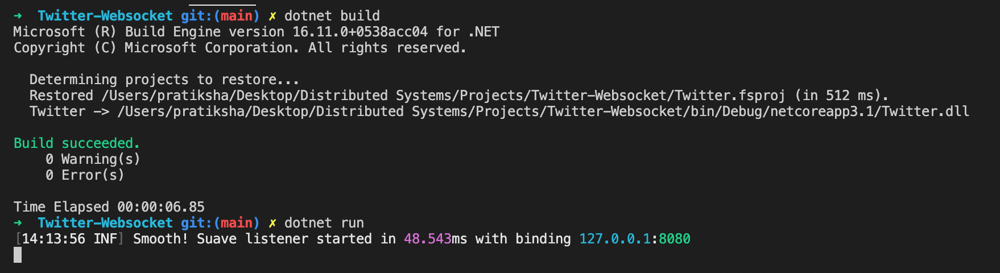

# COP5615 - Distributed Operating System Principles
## Project 4 Part 2
## Twitter Clone with Websocket implementation

Author: 
Anuj Koli - UFID: 97977572 
Pratiksha Jain - UFID: 96115195

## Introduction
In this project we have implemented a twitter clone. We have reused the twitter engine implemented for part 1 of this project and exposed REST API for each function. We added websocket interface to consume those APIs and added basic UI on top of it. 

## How to run 
To run the program, you need to be inside the directory where code exists.

By default the server is listening on your localhost port 8080.

First build the code using - 
> dotnet build

Then start the server using - 
> dotnet run

Finally, you can visit your <localhost:8080> to see that server is running and <localhost:8080/home> to run the application.

## What is working
We implemented Rest APIs and websockets using Sauve webframework in F#. 

### Rest APIs Implementation
- POST Requests 
  - Register User: Registers a user to the system by adding it to list of users.
  - Login User: Checks that if a user exists in list of users then adds it to the list of active users.
  - Follow Users: If the user to follow exists in list of users then adds it to the list of following users.
  - Send Tweet: Adds the new tweet to a list with tweet text and owner of that tweet. 
  - Logout User: Checks if user exists in list of users and the list of active users, then removes it only from list of active users.
 
- GET Requests 
  - Tweets: Returns all tweets tweeted by that user and tweets by users whom it follows. 
  - Hashtags: Returns all tweets with the hashtag text user requested. 
  - Mentions: Returns all tweets where the user is tagged or mentioned. 

After these messages are created, respective actor handles the message and performs action on them.

### Websocket Implementation
- The actor WebsocketHandler manages the websocket connection initiated by client. 
- 

### Request and Response formats
| Request Type | Request Endpoint | Request parameters | Response body | Response comments |
|-----------|--------------|----------------|----------------|----------------|
| POST | /register | { Username: < username >, Password: < password > } | | Success/Failure |
| POST | /login | { Username: < username >, Password: < password > } | | Success/Incorrect password/New user |
| POST | /logout | { Username: < username > } | | Success/Not logged in/New user |
| POST | /newtweet | { Username: < username >, Tweet: < tweet text > } | | Success/Not logged in/New user |
| POST | /follow | { Username: < username >, Following: < follow user > } | | Success/Not logged in/New user/Follower does not exist/Already Following |
| GET | /gettweets/username | | { tweet1, tweet2... } | Success/Not logged in/New user |
| GET | /gethashtags/username/hashtag | | hashtags in { tweet1, tweet2... } | Success/Not logged in/New user |
| GET | /getmentions/username | | mentions in { tweet1, tweet2... } | Success/Not logged in/New user |